# 支付宝测试环境开发前期准备

#### 下载Java支付的demo

[电脑网站支付SDK&Demo ](https://docs.open.alipay.com/270/106291/)

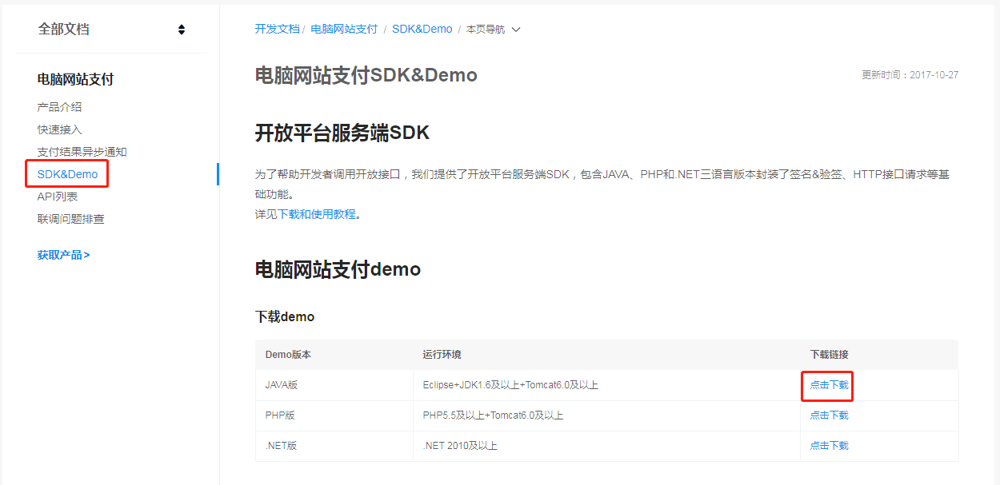

#### 下载解压导入IDEA

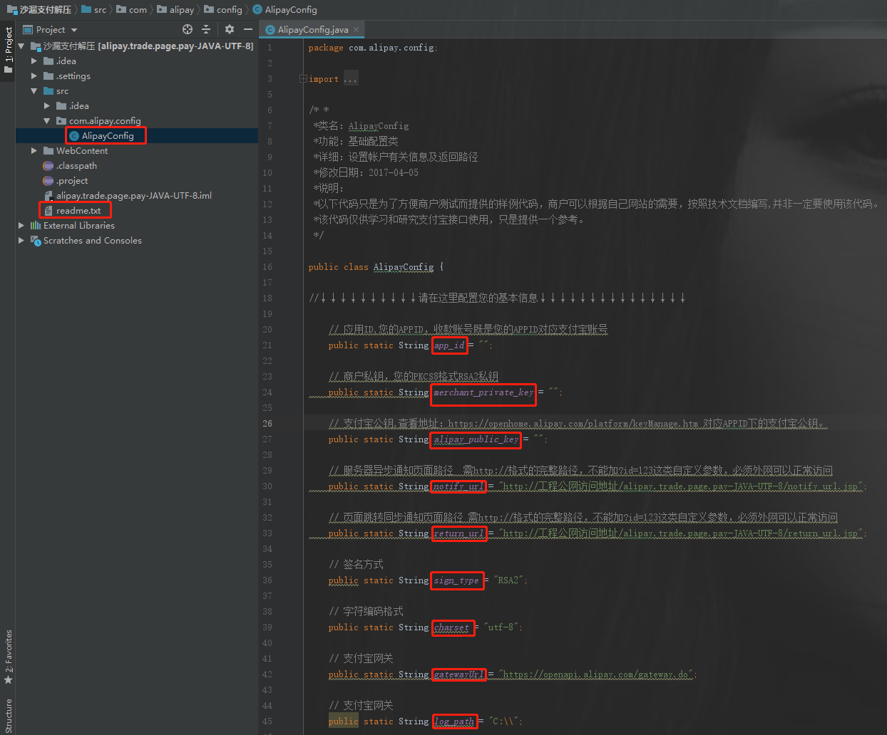

#### 配置AlipayConfig

1. 免费注册蚂蚁金服开发者账号

   注册地址：[https://open.alipay.com](https://open.alipay.com/) ，用你的支付宝账号扫码或者账号登录，完善个人信息，选择服务类型（自研）。

2. 设置app_id和gatewayUrl（支付宝网关）

   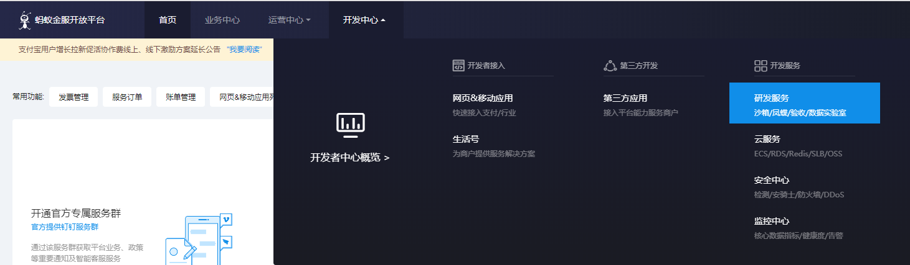

   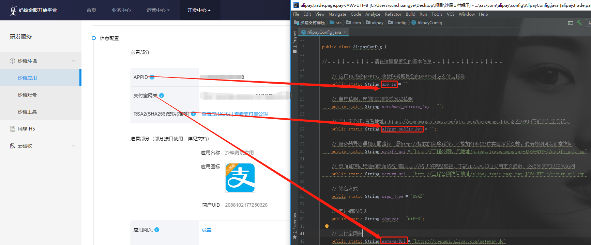

   **其中密钥需要自己生成，appID和支付宝网关是已经给好的，网关有dev字样，表明是用于开发测试。**

   1. 设置秘钥

      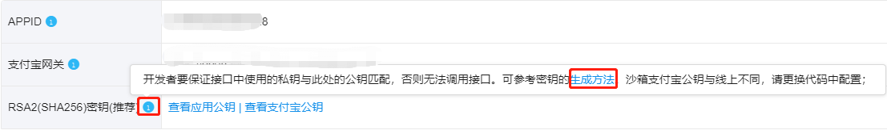

      点击“生成方法”，打开界面如下图：

      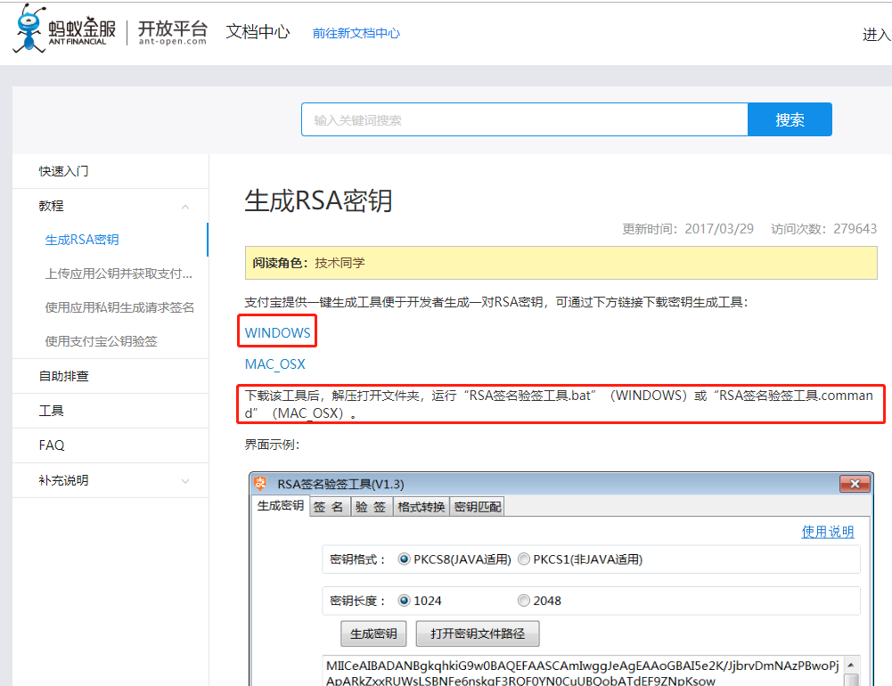

      下载密钥生成工具，解压打开后，双击脚本文件 “RSA签名验签工具.bat” 即运行RSA签名验签工具，选择PKCS8(Java适用)和2048位生成密钥：

      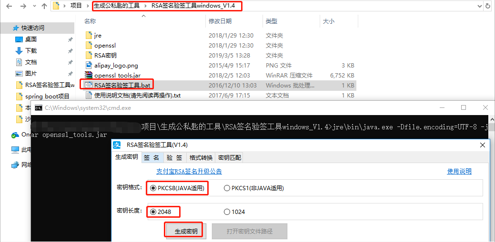

      如果没有设置过，此时显示文本是“设置应用公钥”

      设置方法,“打开密钥文件路径”：

      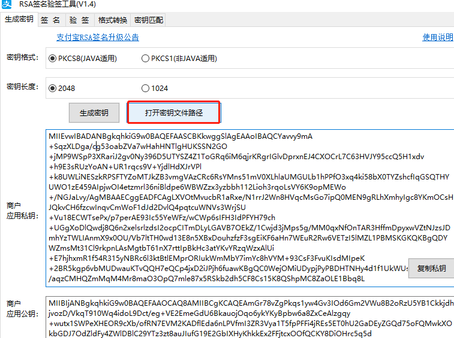

      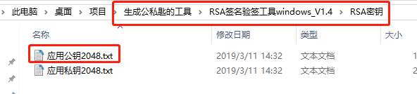

       复制应用公钥2048.txt中的内容到点击“设置应用公钥”的弹出框中，保存：

      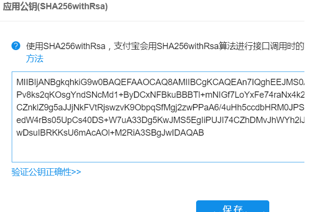

   2. 商户私钥（merchant_private_key）

      复制 应用私钥2048.txt 中的内容到merchant_private_key中。

   3. 支付宝公钥（alipay_public_key）

      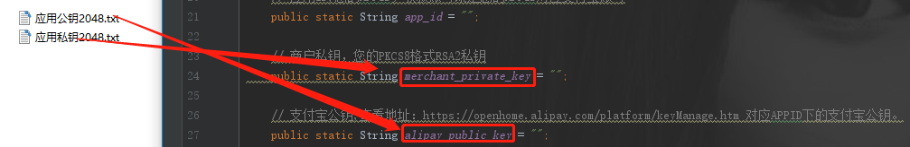

   4. 服务器异步通知页面路径（notify_url）

      如果没有改名，修改IP和端口号就可以了

      ```shell
      http://localhost:8080/alipay/alipayNotifyNotice
      ```

      

   5. 页面跳转同步通知页面路径（return_url）

      ```shell
      http://localhost:8080/alipay/alipayReturnNotice
      ```

      

      